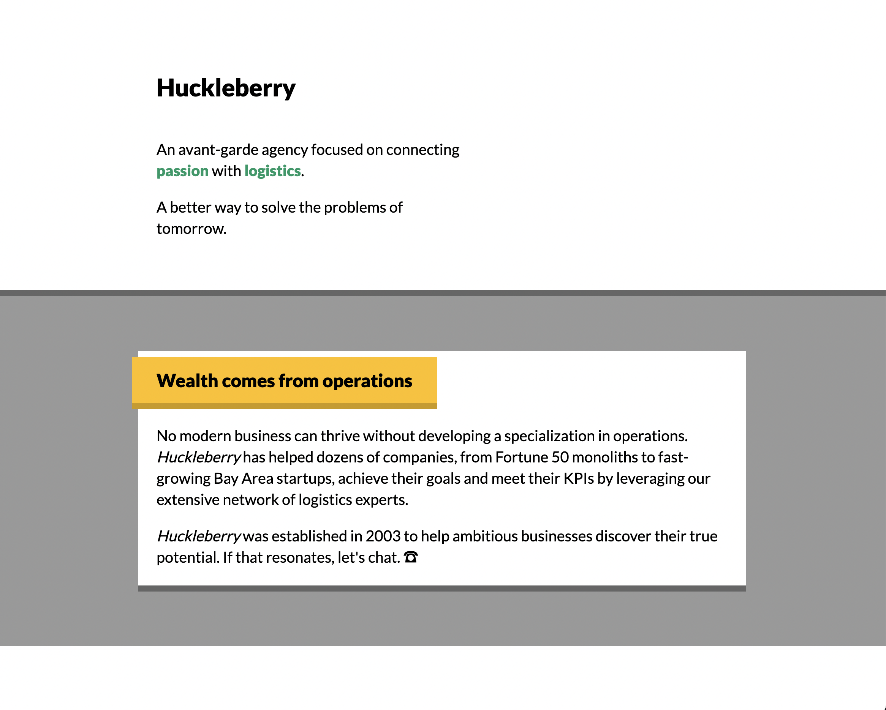
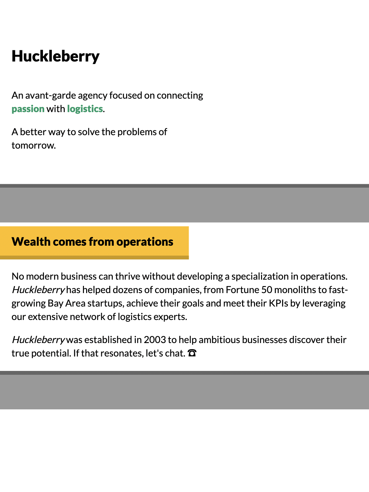
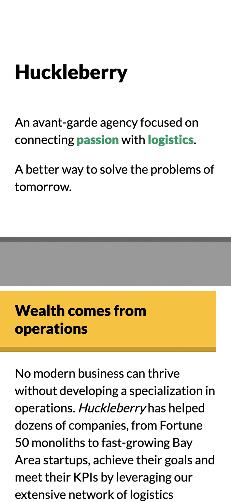

# Goal

Building this mockup entirely using _flow layout_: no Flexbox, no grid, no absolute positioning. It relies heavily on padding, margin, and border.

#### [Live Demo](https://stackblitz.com/edit/github-dgvuek  "https://stackblitz.com/edit/github-dgvuek")

## Mockups

Desktop:

Tablet:

Mobile:

